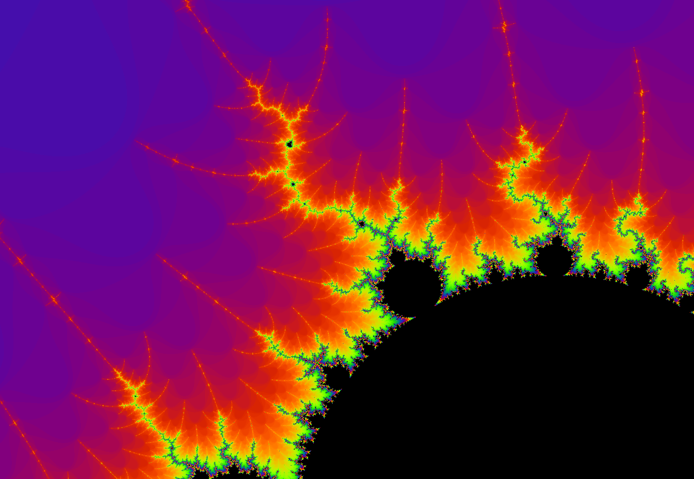
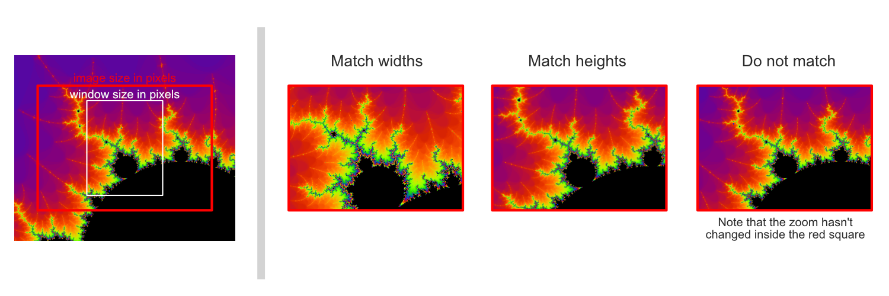

# Fractal visualizer made with OpenGL

### CONTROLS

> WASD - movement

> E - zoom inward
>
> Q - zoom outward
>
> R - reset position
>
> T - give info  (position, zoom, iterations, variable position)
> 
> X - add iterations
> 
> Z - remove iterations
>
> F - show framerate and iterations
>
> P - save image    (If OpenGL 430 is enabled)

> 1 - free roam mode
>
> 2 - variable mode

> LEFT CLICK   - select / deselect
> 
> RIGHT CLICK  - teleport
> 
> MIDDLE CLICK - give info  (mouse position on the window, mouse position on in the world)

### MODES

In variable mode there is a green dot that acts as a variable for the fractal.
This green dot can be moved by first selecting it with LEFT CLICK.
On the top right corner there is also another smaller green dot which can be moved to offset the variable by a smaller amount.

In free foam mode all these this are hidden.

### Saving Images
If OpenGL version 430 is enabled, images can be taken by pressing P.
The image will be taken at the current position with the current zoom.
Once you decide the wanted width and height of the image you must also tell the program how you want the image to be scaled,
as there can be a lot of ambiguity if the given image size and window size are very different.
This is why there are three methods that can be selected during image creation: Match widths, match heights, do not match. 
Match widths will make sure that the width of the image and that of the window will visually match.
Match heights will do the same but for the height.
They do this by zooming in when the lenght of the image is larger, or out when it is smaller.
Do not match will simply take the image at the current location without changing zoom, keeping the same detail as seen on the window

### TEXTURES

DO. NOT. OPEN THE TEXTURE FOLDER